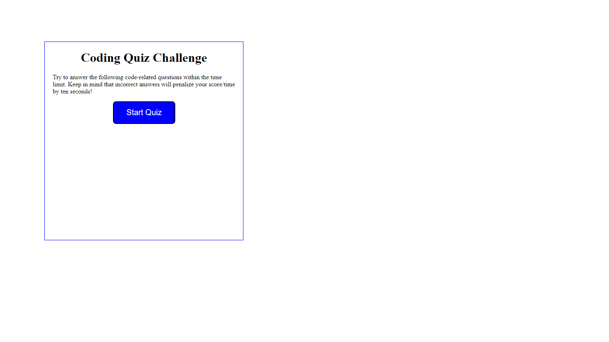
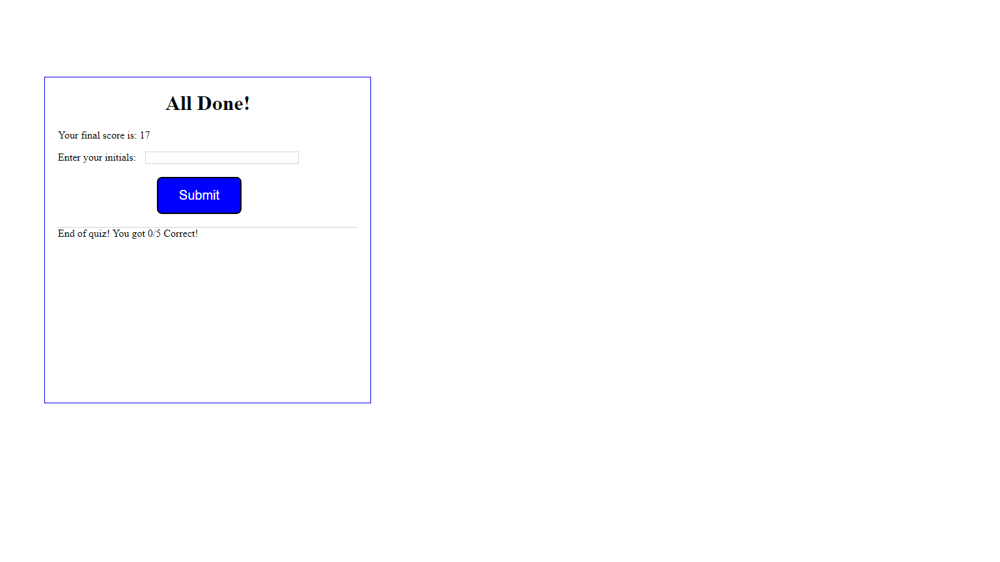
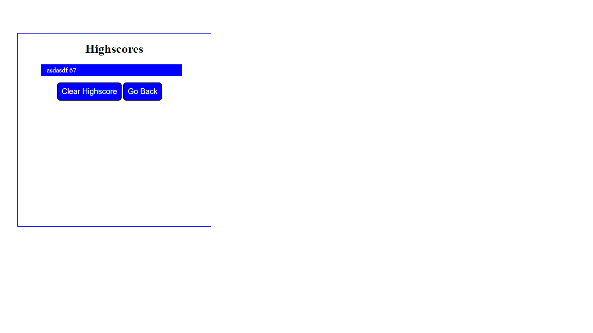

# Coding Quiz

## Description

The following project was made to test a little amount of you knowledge about coding

You can access more badges and their purposes at [shields.io](https://shields.io)

## Table of Contents

- [Usage](#usage)
- [Questions](#questions)
- [License](#license)

## Usage

_Instructions for use:_

To use the application you can run ther Github pages link created and then, you start the quiz by clicking the start button and anser each question. You have a limit time to answer the question and each time you get a wrong answer you will be deducated points.

## Pcitures of quiz

_Contact Info:_

GitHub: [Eddie-m11](https://github.com/Eddie-m11)

Email: [emonarrez.01@outloom.com](mailto:emonarrez.01@outloom.com)

## License

_This application has the ._

For more information please view the [license description]().
